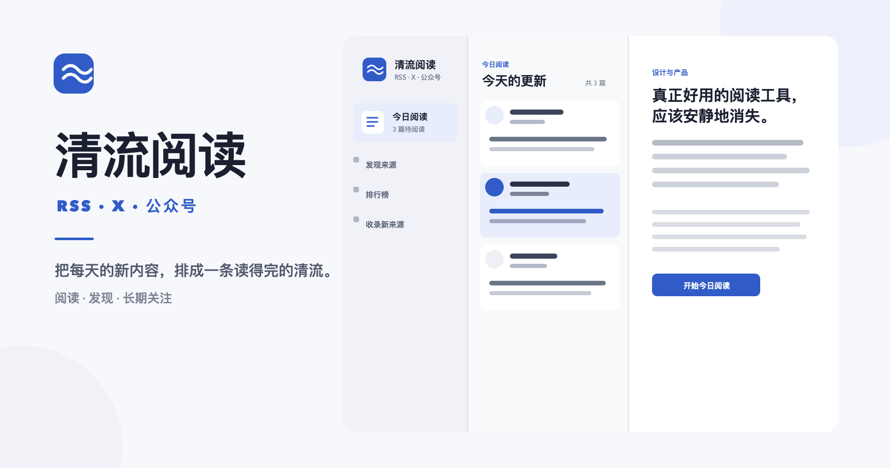

# 清流阅读

一个可自行部署的 RSS、X 与微信公众号阅读工作台。它把关注来源的新内容组织成连续阅读流，并提供发现来源、收藏、批注、阅读进度和个人主页。



## 功能

- 聚合 RSS、X 作者和微信公众号内容
- 今日阅读流、预计阅读时间、已读和收藏状态
- 来源发现、关注、取消关注和导入队列
- 文章批注、回复、通知与个人主页
- D1 持久化和 R2 媒体存储
- 可选的 Cloudflare Workers AI 中文处理
- Cloudflare Worker 定时同步 RSS 与 X
- 可选的本机微信公众号采集流程

## 技术栈

- Next.js 16、React 19、TypeScript
- vinext、Vite、Cloudflare Workers
- Drizzle ORM、Cloudflare D1、R2

## 本地运行

需要 Node.js `>=22.13.0`。

```bash
git clone https://github.com/zhangtianze703-design/qingliu-reader.git
cd qingliu-reader
npm install
npm run dev
```

本地开发会使用项目配置的本地 D1。首次打开时注册一个账号即可使用。仓库不包含任何生产用户数据、第三方文章正文或微信公众号图片。

没有 AI 绑定时，RSS 收集、中文内容、收藏和批注仍可工作；需要翻译的外文条目会保留原文并等待处理。

## 验证

```bash
npm run lint
npm test
npm run db:generate
```

`npm test` 会先执行生产构建，再运行项目测试。

## 部署

项目面向 Cloudflare Workers 运行时，并在 `.openai/hosting.json` 中声明以下逻辑绑定：

- `DB`：Cloudflare D1 数据库
- `MEDIA`：Cloudflare R2 存储桶
- `AI`：可选的 Workers AI binding

部署自己的副本时，请创建独立的 D1 和 R2 资源，不要复用他人的项目标识或生产数据。数据库结构位于 `db/schema.ts`，迁移位于 `drizzle/`。

远程导入接口使用 `IMPORT_TOKEN` 保护。请在托管平台生成高强度随机值并作为 secret 配置，不要提交到 Git。`.env.example` 只列出变量名称和示例。

## 微信公众号采集

微信公众号采集是可选能力，依赖本机 Python 采集脚本和有效的公众号登录状态。配置这些环境变量后运行：

```bash
export RSS_AI_ENDPOINT=http://localhost:3000
export WECHAT_WIZARD=/absolute/path/to/wechat_wizard.py
export WECHAT_DOWNLOADER=/absolute/path/to/wechat_downloader.py
npm run sync:wechat
```

macOS 定时任务模板位于 `scripts/com.personal-intel-desk.wechat-sync.plist`。使用前必须把其中的占位路径替换为自己机器上的绝对路径。请只导入你有权保存和使用的内容。

## 数据与版权

本仓库只提供软件代码，不附带抓取的文章正文、用户数据或第三方媒体。使用者需要自行确认订阅、存储和展示内容的合法性，并遵守内容来源的服务条款和版权要求。

## License

[MIT](LICENSE)
